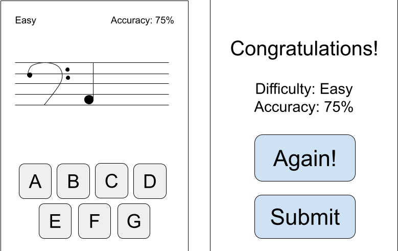
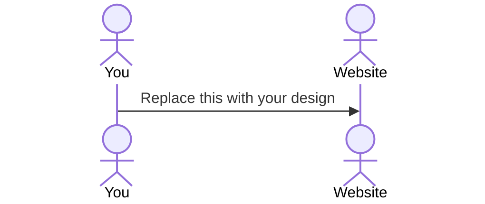

# A to G

A to G (notes.md)

An application that helps beginner music students learn to read music notes.

> [!NOTE]
> This is a template for your startup application. You must modify this `README.md` file for each phase of your development. You only need to fill in the section for each deliverable when that deliverable is submitted in Canvas. Without completing the section for a deliverable, the TA will not know what to look for when grading your submission. Feel free to add additional information to each deliverable description, but make sure you at least have the list of rubric items and a description of what you did for each item.

> [!NOTE]
> If you are not familiar with Markdown then you should review the [documentation](https://docs.github.com/en/get-started/writing-on-github/getting-started-with-writing-and-formatting-on-github/basic-writing-and-formatting-syntax) before continuing.

## 🚀 Specification Deliverable

> [!NOTE]
> Fill in this sections as the submission artifact for this deliverable. You can refer to this [example](https://github.com/webprogramming260/startup-example/blob/main/README.md) for inspiration.

For this deliverable I did the following. I checked the box `[x]` and added a description for things I completed.

- [x] Proper use of Markdown
- [x] A concise and compelling elevator pitch
- [x] Description of key features
- [x] Description of how you will use each technology
- [x] One or more rough sketches of your application. Images must be embedded in this file using Markdown image references.

### Elevator pitch

Have you ever known an overworked music teacher? Have they had to miss out on spending time with their friends or family trying desperately to research ways to help students new to music catch up to students who have studied for years? The A to G application is designed to help students learn to quickly read notes in a way they can practice in places or times where they cannot bring their instrument and practice.     `As each student improves their musical literacy, students will gain confidence in themselves.

### Design

Here is a basic design of the screens the user will see while interacting with the app.

### Key features

- Usable in a variety of devices
- Secure login with HTTPS
- Ability for a teacher account to review submitted scores of their students
- Students able to submit scores to a database

### Technologies

I am going to use the required technologies in the following ways.

- **HTML** - html for the settings options.
- **CSS** - css to make the app look pretty for different phone sizes, one version for light mode one for dark mode.
- **React** - react login in home screen, the buttons to change difficulty/settings, letters a-g for the user to click when the note comes up.
- **Service** - service sends high scores to the database, sends login information to database.
- **DB/Login** - DB stores high scores, login information, and which teacher they are under.
- **WebSocket** - WebSocket scores are sent to a teacher to grade.

## 🚀 AWS deliverable

For this deliverable I did the following. I checked the box `[x]` and added a description for things I completed.

- [x] **Server deployed and accessible with custom domain name** - [My server link](https://yourdomainnamehere.click).

## 🚀 HTML deliverable

For this deliverable I did the following. I checked the box `[x]` and added a description for things I completed.

- [x] **HTML pages** - I did a home (index.html), play, score, teacher view (teacher.html), and about page.
- [x] **Proper HTML element usage** - I used p for text, h1 for headers, and more. There is a head and body with a header and footer for each page. It all works.
- [x] **Links** - I successfully linked the pages so they flowed in the way I wanted. I also have my Github link at the bottom of each page.
- [x] **Text** - I have a brief paragraph in about.html describing how to play.
- [x] **3rd party API placeholder** - I put in a congratulatory message that will be provided by a 3rd party API in the future in scores.html.
- [x] **Images** - I put in the image of a treble clef in play.html.
- [x] **Login placeholder** - I put a place for a student login and a teacher login in index.html. They may be combined in the future, but for now are separate to show how the student scores can only be seen by the teacher.
- [x] **DB data placeholder** - I put in a table of student scores that will be from a database in teacher.html.
- [x] **WebSocket placeholder** - In teacher.html the teacher will receive notifications when student's submit a new score.

## 🚀 CSS deliverable

For this deliverable I did the following. I checked the box `[x]` and added a description for things I completed.

- [x] **Visually appealing colors and layout. No overflowing elements.** - I used a very light blue for the background, and darker colors (mostly blue or black) for the forground to give the app an open feel. When the screen dimension changes, the elements recenter.
- [x] **Use of a CSS framework** - I used a file called styles.css to contain all the css.
- [x] **All visual elements styled using CSS** - I specified the alignment of everything with CSS, changed the font of all the text, and made everything work with different size screens.
- [x] **Responsive to window resizing using flexbox and/or grid display** - I used display flex for the buttons a-g, text-align for the text, and for the image I tried setting the margin-left and margin-right to auto.
- [x] **Use of a imported font** - I imported and used multiple fonts, one of them being the header title font (the AtoG at the top of each page).
- [x] **Use of different types of selectors including element, class, ID, and pseudo selectors** - I used element selectores such as p and h1, class selectors (letters and the letterlist container for letters), an ID for the encouragement API (scores.html or the css is in the section beneath class selectors) and a pseudo selector at the very bottom of my CSS file so the link to GitHub changes to a color in theme with the rest of the app (blue) not orange.

## 🚀 React part 1: Routing deliverable

For this deliverable I did the following. I checked the box `[x]` and added a description for things I completed.

- [ ] **Bundled using Vite** - I did not complete this part of the deliverable.
- [ ] **Components** - I did not complete this part of the deliverable.
- [ ] **Router** - I did not complete this part of the deliverable.

## 🚀 React part 2: Reactivity deliverable

For this deliverable I did the following. I checked the box `[x]` and added a description for things I completed.

- [ ] **All functionality implemented or mocked out** - I did not complete this part of the deliverable.
- [ ] **Hooks** - I did not complete this part of the deliverable.

## 🚀 Service deliverable

For this deliverable I did the following. I checked the box `[x]` and added a description for things I completed.

- [ ] **Node.js/Express HTTP service** - I did not complete this part of the deliverable.
- [ ] **Static middleware for frontend** - I did not complete this part of the deliverable.
- [ ] **Calls to third party endpoints** - I did not complete this part of the deliverable.
- [ ] **Backend service endpoints** - I did not complete this part of the deliverable.
- [ ] **Frontend calls service endpoints** - I did not complete this part of the deliverable.
- [ ] **Supports registration, login, logout, and restricted endpoint** - I did not complete this part of the deliverable.

## 🚀 DB deliverable

For this deliverable I did the following. I checked the box `[x]` and added a description for things I completed.

- [ ] **Stores data in MongoDB** - I did not complete this part of the deliverable.
- [ ] **Stores credentials in MongoDB** - I did not complete this part of the deliverable.

## 🚀 WebSocket deliverable

For this deliverable I did the following. I checked the box `[x]` and added a description for things I completed.

- [ ] **Backend listens for WebSocket connection** - I did not complete this part of the deliverable.
- [ ] **Frontend makes WebSocket connection** - I did not complete this part of the deliverable.
- [ ] **Data sent over WebSocket connection** - I did not complete this part of the deliverable.
- [ ] **WebSocket data displayed** - I did not complete this part of the deliverable.
- [ ] **Application is fully functional** - I did not complete this part of the deliverable.
